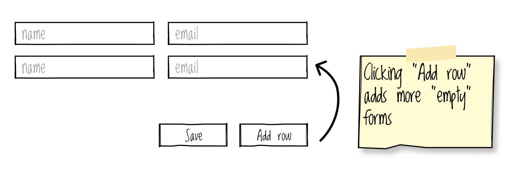

Bulk Create Form
================

May 2024


A dynamic bulk create form like the mockup displayed here is not immediately obvious how to do in Django but it is
fairly simple to setup something both as a server-managed or a js-managed solution using formsets.




Django Formsets
---------------

[Django Formsets](https://docs.djangoproject.com/en/stable/topics/forms/formsets/) are the go-to for the handling of a
series of forms like this, though there are some tweaks we need to make:

 - We are only interesting in creating new records, not editing existing ones. **Django has this important gotcha that it
   will load existing records into the formset without you telling it to so** - you need to explicitly tell it not to
   do that.
 - We want validation to including checking that at least one record has been entered.
 - We want to dynamically add more rows to the formset to allow the user to create as many records as they wish (up
   until the hard limits preventing DoS).

With that in mind we can do the following:


Prevent Loading Existing Records
--------------------------------

Django's `BaseModelFormset` will load data into the formset by using the class's `queryset` attribute (obtained via
`get_queryset()`), or the default manager from the model if no `queryset` attribute is defined.  We need to stop the
formset from using the default manager:

 - We must prevent the formset from loading data by using `QuerySet.none()`
 - There's no way to define `queryset` from `modelformset_factory()`, meaning we need to define a subclass of
   `BaseModelFormset`
 - `BaseModelFormset.__init__()` will override any class attribute named `queryset`

```python
# modelformset_factory() unfortunately has no way to set queryset & prevent loading from the db
class BaseUserFormSet(BaseModelFormSet):

    # option 1: supply none() to __init__()
    def __init__(self, *args, **kwargs):
        super().__init__(*args, queryset=User.objects.none(), **kwargs)

    # option 2: override get_queryset()
    def get_queryset(self):
        return User.objects.none()

def bulk_create_users(request):
    UserFormSet = modelformset_factory(
        model=User,
        formset=BaseUserFormSet,
        fields="__all__",
    )
```


Validation to ensure at least 1 record was entered
--------------------------------------------------

Formsets allow for creation of new records by adding a number of "empty" forms; forms where `empty_permitted = True`.
Validation will pass for any of these forms that have no values entered. To make sure that a certain number of forms are
not "empty" we can fortunately set the `min_num` attribute on the formset. By doing so though we need to tell the
formset to not render any additional empty forms with `extra = 0`:

```python
def bulk_create_users(request):
    UserFormSet = modelformset_factory(
        model=User,
        formset=BaseUserFormSet,
        fields="__all__",
        min_num=1,
        extra=0,
    )
```


Server Managed Dynamic Formset
------------------------------

The trick with getting a dynamic formset to work is to increase the `extra` attribute beyond the initial value of `0`. Fortunately
Django formsets come with a "management form" to keep track of a few things like the total number of form & the minium number 
of submissions required. We can use this for the basis of our calculation by adding an "Add row" submit button to POST the current
number of forms.

First add your "Add row" button and give it a name, eg `add-row`. Be sure to add `formnovalidate` so that client-side validation
is skipped as we don't care about validation while the user is requesting more rows:

```html
<form>
    ... render formset ...
    <button>Save</button>
    <button name="add-row" formnovalidate>Add row</button>
</form>
```

Then we can check for `add-row` in `request.POST` then increment `extra` and render the form. Remember that since `extra`
is zero-based and we're incrementing 1 form at a time, all we need to do is assign the current number of forms to `extra`:

```python
def bulk_create_users(request):
    ...
    if request.method == "POST" and "add-row" in request.POST:
        UserFormSet.min_num = int(request.POST["form-TOTAL_FORMS"])
        formset = UserFormSet()
    ...
```

Lastly we need to preserve anything the user has input into the form fields, without validating any of that input. Since
accessing validation errors in your template will trigger validation of input supplied through a form's `data` kwarg we
need to use a different approach like setting the input via `initial`. A formset's `initial` kwarg requires the initial
data to be supplied as an iterable of each form's initial data, meaning that some minor conversion of data is required.

Formsets will use the following format to submit data:

```
{
    "form-0-name": "David",
    "form-0-email": "colonel@kfc.com.au",
    "form-1-name": "Second user",
    "form-1-email": "Second user email",
    ...
}
```

Formsets' `initial` requires this format:

```
[
    {
        "name": "First user",
        "email": "First user email",
    },
    {
        "name": "Second user",
        "email": "Second user email",
    },
    ...
]
```

A comprehension can do the job:

```python
initial = [
    {
        field_name: request.POST.get(f"form-{i}-{field_name}")
        for field_name in UserFormSet.form.base_fields
    }
    for i in range(int(request.POST["form-TOTAL_FORMS"]))
]
```

Altogether the view looks like this:

```python
class BaseUserFormSet(BaseModelFormSet):
    # modelformset_factory() unfortunately has no way to set queryset & prevent loading from the db
    def get_queryset(self):
        return User.objects.none()


def bulk_create_users(request):
    UserFormSet = modelformset_factory(
        model=User,
        formset=BaseUserFormSet,
        fields="__all__",
        min_num=1,
        extra=0,
    )

    if request.method == "POST" and "add-row" in request.POST:
        # extra is zero-based, so extra = current total since total = min_num + extra
        UserFormSet.extra = int(request.POST["form-TOTAL_FORMS"])
        # preserve user input without binding the form by loading it as initial
        initial = [
            {
                field_name: request.POST.get(f"form-{i}-{field_name}")
                for field_name in UserFormSet.form.base_fields
            }
            for i in range(int(request.POST["form-TOTAL_FORMS"]))
        ]
        formset = UserFormSet(initial=initial)

    elif request.method == "POST":
        formset = UserFormSet(data=request.POST)
        if formset.is_valid():
            formset.save()
            users = [form.instance for form in formset.forms]
            return render(request, "bulk_create_form/success.html", {"users": users})
    else:
        formset = UserFormSet()

    return render(request, "bulk_create_form/bulk_create.html", {"formset": formset})
```


JavaScript Managed Dynamic Formset
----------------------------------

Adding new forms with JavaScript is also quite straight forward by doing the following:

1. `FormSet` provides an [`empty_form`](https://docs.djangoproject.com/en/5.0/topics/forms/formsets/#empty-form)
   attribute for this purpose. We can embed this in a
   [`<template/>`](https://developer.mozilla.org/en-US/docs/Web/HTML/Element/template) and clone it when needed. The
   `__prefix__` prefix needs to be replaced with the new index; these are zero-based so it will be simply the current
   number of forms.
2. The management form contains a record of the total number of forms in the formset. This needs to be incremented when
   adding new forms.
3. The "add rows" button must become a regular button to avoid submitting the form.


```html
<form method="POST">
  
  {{ formset.management_form }}
  <table id="form-table">
    <tr>
      <th>Name</th>
      <th>Email</th>
    </tr>
    
      <tr>
        <td valign="top">
          {{ form.name }}
          
            <br /><span style="color:firebrick">{{ error }}</span>
          
        </td>
        <td valign="top">
          {{ form.email }}
          
            <br /><span style="color:firebrick">{{ error }}</span>
          
        </td>
      </tr>
    
  </table>
  <template id="new-row">
    <tr>
      <td valign="top">
        {{ formset.empty_form.name }}
      </td>
      <td valign="top">
        {{ formset.empty_form.email }}
      </td>
    </tr>
  </template>
  <button>Save</button>
  <button name="add-row" type="button" onclick="addRow()">Add row</button>
  <script>
    function addRow() {
      // get the current number of rows from the "management form"
      const totalForms = document.getElementById('id_form-TOTAL_FORMS');

      // clone the template containing the "empty form" and append it to the formset table
      const newRow = document.getElementById('new-row').content.cloneNode(true);
      newRow.querySelectorAll('[name*="__prefix__"]').forEach(el => {
        el.name = el.name.replace("__prefix__", totalForms.value);
      });
      document.getElementById('form-table').appendChild(newRow);

      // increment the management form's record of rows
      totalForms.value = parseInt(totalForms.value) + 1;
    }
  </script>
</form>
```


